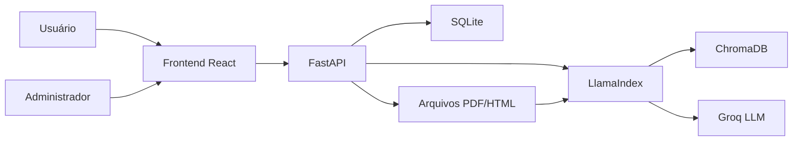

# PortoGpt

PortoGpt é uma aplicação web para consulta inteligente de documentos internos, com foco em arquivos técnicos, administrativos e portuários. O sistema combina upload e aprovação de PDFs, indexação vetorial, chat com IA, histórico de conversas e painel administrativo para controlar usuários, documentos, templates e configurações da IA.

O objetivo do projeto é transformar uma base documental tradicional em uma experiência de busca conversacional, permitindo que usuários façam perguntas em linguagem natural e recebam respostas contextualizadas com base nos documentos aprovados.

## Visão Geral



## Funcionalidades

- Chat com IA baseado em documentos aprovados.
- Upload de PDFs por usuários autenticados.
- Fluxo de solicitações com status: pendente, aprovado e reprovado.
- Painel administrativo para aprovação/reprovação de documentos.
- Histórico de solicitações com visualização do original e do processado.
- Gerenciamento de PDFs da base oficial.
- Indexação vetorial com ChromaDB.
- Templates HTML para gerar prévias/processamento de documentos.
- Configurações administrativas da IA: tom, regras, top-k e instruções customizadas.
- Gestão de usuários com papéis: admin, editor e viewer.
- Histórico de chats e sessões.
- Notificações de movimentações em documentos.

## Tecnologias

### Frontend

- React 19
- Vite
- Lucide React
- React Markdown
- HTML2PDF.js

### Backend

- Python
- FastAPI
- SQLite
- LlamaIndex
- ChromaDB
- Groq API
- HuggingFace Embeddings
- Playwright para renderização de PDF
- Jinja2 para templates
- PyPDF/PyMuPDF para leitura e processamento de documentos

## Estrutura do Projeto

```txt
PortoGpt/
|-- backend/
|   |-- main.py                 # API principal FastAPI
|   |-- database.py             # Camada SQLite e regras de persistência
|   |-- ingest.py               # Indexação vetorial com ChromaDB
|   |-- processamento_dados.py  # Extração/estruturação de conteúdo
|   |-- processamento_template.py
|   |-- requirements.txt
|   |-- data/                   # Base oficial usada pela IA
|   |-- pending_uploads/        # Uploads originais pendentes/reprovados
|   |-- processed_uploads/      # Versões processadas/prévias
|   |-- templates/              # Templates HTML/PDF
|   `-- portogpt.db             # Banco SQLite local
|-- frontend/
|   |-- src/
|   |   |-- App.jsx
|   |   |-- App.css
|   |   `-- main.jsx
|   |-- package.json
|   `-- vite.config.js
`-- README.md
```

## Como Funciona

1. Um usuário envia um documento pelo chat ou pela área de solicitações.
2. O sistema salva o arquivo original e gera uma versão processada para visualização.
3. Administradores acompanham as solicitações, visualizam original/processado e aprovam ou reprovam.
4. Documentos aprovados entram na base oficial.
5. A base é reindexada no ChromaDB.
6. O chat usa recuperação vetorial para buscar trechos relevantes e responder com apoio do LLM.

## Pré-requisitos

- Python 3.11 ou superior
- Node.js 20 ou superior
- npm
- Conta/chave da Groq API

## Configuração do Backend

Entre na pasta do backend:

```bash
cd backend
```

Crie e ative um ambiente virtual:

```bash
python -m venv .venv
```

No Windows:

```bash
.venv\Scripts\activate
```

No Linux/macOS:

```bash
source .venv/bin/activate
```

Instale as dependências:

```bash
pip install -r requirements.txt
```

Instale o Chromium usado pelo Playwright:

```bash
python -m playwright install chromium
```

Crie um arquivo `.env` dentro de `backend/`:

```env
secret_key=SUA_CHAVE_DA_GROQ
PORTOGPT_ADMIN_EMAIL=admin@portogpt.com
PORTOGPT_ADMIN_PASSWORD=admin123
```

> Troque o e-mail e a senha padrão do administrador antes de usar o projeto em um ambiente real.

Inicie a API:

```bash
uvicorn main:app --host 127.0.0.1 --port 8000 --reload
```

A API ficará disponível em:

```txt
http://127.0.0.1:8000
```

Documentação interativa do FastAPI:

```txt
http://127.0.0.1:8000/docs
```

## Configuração do Frontend

Em outro terminal, entre na pasta do frontend:

```bash
cd frontend
```

Instale as dependências:

```bash
npm install
```

Rode o servidor de desenvolvimento:

```bash
npm run dev -- --host 127.0.0.1
```

O frontend ficará disponível em:

```txt
http://127.0.0.1:5173
```

## Usuário Administrador Inicial

Se ainda não existir nenhum administrador no banco, o backend cria um usuário inicial automaticamente:

```txt
E-mail: admin@portogpt.com
Senha: admin123
```

Esses valores podem ser alterados pelas variáveis:

```env
PORTOGPT_ADMIN_EMAIL=
PORTOGPT_ADMIN_PASSWORD=
```

## Principais Endpoints

| Método | Rota | Descrição |
| --- | --- | --- |
| `POST` | `/api/register` | Cadastro de usuário |
| `POST` | `/api/login` | Login |
| `POST` | `/api/chat` | Pergunta ao assistente |
| `POST` | `/api/chat/stream` | Chat com resposta em streaming |
| `GET` | `/api/chat/sessions/{user_id}` | Lista sessões de chat |
| `POST` | `/api/upload` | Upload de documento |
| `GET` | `/api/submissions` | Lista solicitações |
| `GET` | `/api/submissions/{id}/raw` | Visualiza arquivo original |
| `GET` | `/api/submissions/{id}/processed` | Visualiza versão processada |
| `POST` | `/api/submissions/{id}/approve` | Aprova documento |
| `POST` | `/api/submissions/{id}/reject` | Reprova documento |
| `GET` | `/api/docs` | Lista documentos da base |
| `POST` | `/api/docs/reindex` | Reindexa a base |
| `GET` | `/api/templates` | Lista templates |
| `POST` | `/api/render-pdf` | Renderiza HTML como PDF |

## Papéis de Usuário

| Papel | Permissões principais |
| --- | --- |
| `admin` | Gerencia usuários, aprova solicitações, altera configurações e documentos |
| `editor` | Pode enviar e gerenciar documentos com aprovação interna |
| `viewer` | Consulta a IA, envia solicitações e acompanha seus próprios documentos |

## Pastas de Documentos

| Pasta | Uso |
| --- | --- |
| `backend/data/` | Base oficial indexada pela IA |
| `backend/pending_uploads/` | Arquivos originais enviados e ainda pendentes/reprovados |
| `backend/processed_uploads/` | Prévias ou versões processadas dos uploads |
| `backend/templates/` | Templates usados para formatação e pré-visualização |
| `backend/chroma_db/` | Banco vetorial persistido pelo ChromaDB |

## Comandos Úteis

Rodar backend:

```bash
cd backend
uvicorn main:app --host 127.0.0.1 --port 8000 --reload
```

Rodar frontend:

```bash
cd frontend
npm run dev -- --host 127.0.0.1
```

Gerar build do frontend:

```bash
cd frontend
npm run build
```

Reindexar documentos manualmente:

```bash
cd backend
python ingest.py
```

Limpar e criar índice vazio:

```bash
cd backend
python ingest.py --empty
```

## Observações de Segurança

- Não versionar `.env`.
- Não publicar chaves de API.
- Trocar a senha padrão do administrador.
- Evitar versionar bases locais sensíveis, como `portogpt.db`, `chroma_db/`, PDFs internos e uploads reais.
- Revisar permissões antes de expor a API fora do ambiente local.

## Status do Projeto

Este projeto está em desenvolvimento acadêmico e evolui como uma solução completa de RAG documental, com frontend, backend, autenticação, gestão administrativa, pipeline de documentos e chat inteligente.

## Autoria

Projeto desenvolvido como parte de um Trabalho de Conclusão de Curso, com foco em IA aplicada à gestão e consulta de documentos internos.
